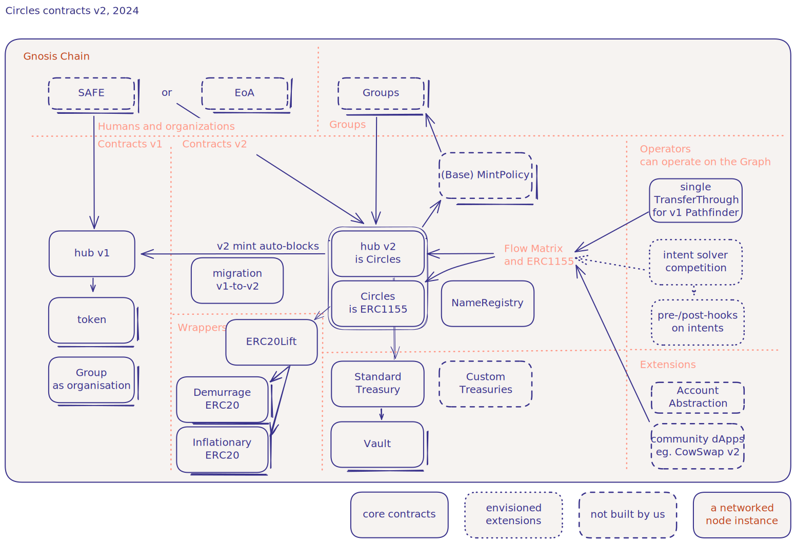

# Circles Architectural Overview

## Introduction

Circles is a decentralized economic system built on the Gnosis Chain, designed to create and distribute fair and social money through personal currencies. This overview provides a high-level understanding of the system's architecture and how its various components interact.

## System Architecture Diagram

<a href="https://link.excalidraw.com/readonly/EuVbVxV3LE0AZ3Od5rpP" target="_blank" rel="noopener noreferrer">
  Open Circles Architecture diagram in new tab
</a>

## Core Components

### Hub v2 (Circles)

The central contract in the Circles ecosystem is the Hub v2, which serves as the main entry point for interactions with the system. It manages:

- Registration of humans, organizations, and groups
- Minting of personal currencies
- Trust relationships between entities
- Group creation and management
- Minting collateral into group currencies
- Wrapping ERC1155 Circles Ids tokens into ERC20 wrappers
- Demurrage of all Circles tokens equally 

The Hub v2 contract implements the ERC1155 standard, allowing it to handle multiple token types efficiently.

[Code: /src/hub/Hub.sol](https://github.com/aboutcircles/circles-contracts-v2/blob/v0.3.6-docs/src/hub/Hub.sol)

### NameRegistry

The NameRegistry contract manages names, symbols and metadata for avatars (humans, groups, and organizations):

- Allows humans to register a unique short name (12 characters, base58 encoding)
- Stores custom names for groups and organizations
- Manages custom symbols for group currencies
- Stores and updates metadata digests (eg IPFS CIDs) for avatar profiles
- Names are read by ERC20 contracts for name and symbol

The NameRegistry plays a role in identity management and human-readable addressing within the Circles system, enhancing user experience and facilitating easier identification of avatars and their associated currencies.

[Code: /src/names/NameRegistry.sol](https://github.com/aboutcircles/circles-contracts-v2/blob/v0.3.6-docs/src/names/NameRegistry.sol)

### Migration

The Migration contract facilitates the transition from Circles v1 to v2, ensuring the ability to migrate token balances:

- Converts v1 Circles to v2 Circles, accounting for inflation and demurrage
- Uses a linear interpolation method to calculate the conversion rate. Corrects for the original convention in hub v1 where 1/3 CRC per hour is issued (8 CRC per day)
- Allows migration of multiple types of Circles balances in a single transaction by one owner
- Locks v1 tokens in the Migration contract and mints equivalent v2 tokens.
- Ensures upon migrating balances that humans are auto-registered in Hub v2 - so that their token is defined
- owners of Circles in v1 can migrate their balances at any time and for any amount they chose to Circles v2.

This Migration system ensures a controlled and secure transition from Circles v1 to v2, maintaining integrity throughout the upgrade process.

[Code: /src/migration/Migration.sol](https://github.com/aboutcircles/circles-contracts-v2/blob/v0.3.6-docs/src/migration/Migration.sol)

### Groups, Policies and Treasury

The Circles ecosystem includes a sophisticated system for managing group currencies, which involves several interconnected components:

#### Groups

- Defined in the Hub contract
- Require a Mint Policy and Treasury for creation
- Can be registered using `hub.registerGroup()`

#### Standard Treasury

1. **Purpose**: Manages collateral for group currencies
2. **Key Features**:
   - Acts as a factory for Vaults
   - Handles minting and redemption of group Circles
   - Interacts with Mint Policies for redemption logic
3. **Functions**:
   - `onERC1155Received`: Handles single token transfers (minting or redemption)
   - `onERC1155BatchReceived`: Handles batch token transfers (minting)
   - Creates Vaults for groups as needed

#### Vaults

1. **Purpose**: Securely store collateral for group currencies
2. **Key Features**:
   - Deployed by Standard Treasury using a factory pattern
   - Each group has its own Vault
3. **Functions**:
   - `returnCollateral`: Sends collateral back to users during redemption
   - `burnCollateral`: Burns collateral as specified by Mint Policy

#### Base Mint Policy

1. **Purpose**: Defines rules for minting, burning, and redeeming group currencies
2. **Key Features**:
   - Customizable for different group needs
   - Default implementation allows all mints/burns and user-specified redemptions
3. **Functions**:
   - `beforeMintPolicy`: Validates minting requests
   - `beforeBurnPolicy`: Validates burning requests
   - `beforeRedeemPolicy`: Specifies redemption logic

#### System Interaction

1. **Group Creation**:
   - User calls `hub.registerGroup()`
   - Hub assigns Standard Treasury
   - Standard Treasury creates a Vault for the group

2. **Minting Group Circles**:
   - Collateral transferred to Treasury
   - Treasury forwards collateral to group's Vault
   - Mint Policy consulted for approval
   - Group Circles minted to user

3. **Redeeming Group Circles**:
   - User sends group Circles to Treasury
   - Treasury consults Mint Policy for redemption logic
   - Vault returns specified collateral to user
   - Excess collateral burned if specified by policy

This system provides a flexible and secure framework for creating and managing group currencies within the Circles ecosystem. It allows for customizable minting and redemption policies while ensuring proper collateralization and secure storage of assets.

## Token Representations

### Circles (ERC1155)

The core representation of Circles currencies uses the ERC1155 standard, allowing for efficient management of multiple token types (personal and group currencies) within a single contract.

### Wrappers

To enhance compatibility with existing DeFi ecosystems, Circles provides ERC20 wrappers:

1. **Demurrage ERC20**: Represents Circles with the demurrage (decay) factor applied.
2. **Inflationary ERC20**: Represents Circles in their inflationary form, without demurrage applied.

### ERC20Lift

The ERC20Lift contract serves as a bridge between the ERC1155 and ERC20 representations, allowing users to wrap and unwrap their Circles tokens as needed.

## Circles v1 Components (Legacy)

### Hub v1

The original Hub contract from Circles v1, which is being phased out but remains relevant for migration purposes.

### Token

The individual ERC20 token contracts for personal currencies in Circles v1.

## External Interactions

### Gnosis Chain

Circles is built on the Gnosis Chain, leveraging its security and efficiency.

### Safe

Integration with Safe (formerly Gnosis Safe) provides secure multi-signature wallet functionality for Circles users.

### EoA (Externally Owned Accounts)

Standard Ethereum accounts that can interact with the Circles system.

## Advanced Features and Extensions

### Intent Solver Competition

(Placeholder) A mechanism for optimizing transactions and transfers within the Circles network.

### Pre-/Post-hooks on Intents

(Placeholder) Additional logic that can be executed before or after certain operations in the system.

### Flow Matrix and ERC1155

A system for managing and executing complex transfers and exchanges of Circles currencies between multiple parties.

### Single TransferThrough for v1 Pathfinder

A mechanism to facilitate transfers using trust pathways, likely a carryover or adaptation from the v1 system.

### Account Abstraction

(Placeholder) Advanced account management features that may simplify user interactions with the system.

### Custom Treasuries

In addition to the Standard Treasury, the system allows for custom treasury implementations to cater to specific group needs.

### Community dApps

The architecture supports the development of community-driven decentralized applications, such as a potential CowSwap v2 integration.

## Conclusion

The Circles v2 architecture represents a significant evolution from its predecessor, offering a more flexible and scalable system for personal and group currencies. By leveraging advanced smart contract standards like ERC1155 and providing multiple token representations, Circles aims to create a robust ecosystem for social money that can integrate seamlessly with the broader DeFi landscape.

This architecture balances the need for a cohesive, centralized hub with the flexibility required for diverse use cases and future extensions. As the system continues to evolve, this modular design will allow for the integration of new features and improvements while maintaining backward compatibility and supporting the migration from v1.
